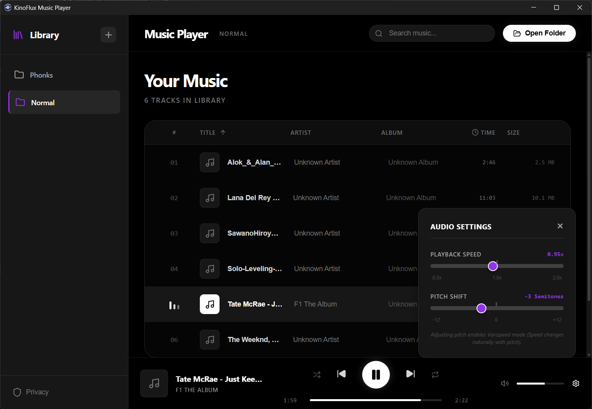

# 🎵 **Kinoflix Music Player**

**Your Personal Music Sanctuary – Private, Powerful, and Perfectly Yours**

A modern desktop music player for audiophiles who value **privacy**, **quality**, and **control**.

---

## ✨ **Why Kinoflix?**

| Feature                       | Description                                                                     |
| ----------------------------- | ------------------------------------------------------------------------------- |
| 🔒 **100% Private & Offline** | No cloud, no tracking, no data collection. Your music stays on your device.     |
| 🎚️ **Pro Audio Controls**     | Adjust playback speed (0.5x-2x) and pitch (-12 to +12 semitones) independently. |
| 📁 **Multi-Library Manager**  | Manage unlimited music folders with individual settings for each.               |
| 💾 **Smart Memory**           | Remembers your last song, position, volume, and preferences per folder.         |
| 🎧 **Universal Formats**      | MP3, FLAC, WAV, M4A, AAC, OGG, Opus, WMA – play them all.                       |

---

## 🚀 **Quick Start**

1. **Download & Install** → Launch the app
2. **Add Music** → Click "Open Folder" or **+** icon in sidebar
3. **Play & Enjoy** → Click any song to start playing

### Key Controls

- **Play/Pause**: Spacebar or click play button
- **Next/Previous**: Skip buttons or arrow keys
- **Search**: Type in the search bar (top right)
- **Advanced Audio**: Click ⚙️ gear icon for speed/pitch controls
- **Sort**: Click column headers (Title, Artist, Album, Time, Size)

---

## 🎯 **Core Features**

**Playback**

- Speed & pitch control (perfect for musicians)
- Shuffle & repeat modes
- Seamless seeking with range support

**Library**

- Multi-folder support with instant switching
- Real-time search across all metadata
- Sortable columns with saved preferences

**Personalization**

- Per-folder audio settings
- Auto-resume from last position
- Custom volume & playback preferences

---

## 💻 **System Requirements**

- **OS**: Windows 10+, macOS 10.15+, Linux
- **Display**: 900x600 minimum (1200x800 recommended)
- **RAM**: 4GB minimum (8GB for large libraries)
- **Storage**: 100MB for app + space for music

---

## 🎵 **Supported Formats**

MP3 • FLAC • WAV • M4A/AAC • OGG • Opus • WMA

---

## 🔐 **Privacy First**

✅ Completely offline – works without internet  
✅ Zero data collection or tracking  
✅ All settings stored locally on your device  
✅ No account required  
✅ Your files are never modified

---

## 🎯 **Perfect For**

- 🎸 **Musicians** practicing at custom speeds/pitches
- 🎧 **Audiophiles** with high-quality FLAC collections
- 🔒 **Privacy-conscious users** who want offline playback
- 📚 **Large library owners** managing multiple folders

---

## 💬 **FAQ**

**Q: Does it need internet?**  
A: No, completely offline.

**Q: Are my settings saved?**  
A: Yes, automatically per folder.

**Q: How many folders can I add?**  
A: Unlimited.

**Q: Does it modify my files?**  
A: Never. Read-only access.

---

## � **License**

Kinoflix Music Player is **closed-source** proprietary software. See the [LICENSE](./LICENSE) file for complete terms and conditions.

**Key Points:**

- ✅ Personal use allowed
- ❌ Closed source (no modifications or redistribution)
- ❌ Non-commercial use only
- ❌ No reverse engineering

---

## �� **Support**

Found a bug or have a feature request? [Open an issue](https://github.com/kinoflux/music-player/issues) on GitHub.

---

Made with ❤️ for music lovers everywhere - **ntxm**

**[⬇️ Download Now](https://github.com/kinoflux/music-player/releases/tag/1.0.0)** • **[📖 Docs](https://github.com/kinoflux/music-player)** • **[🐛 Report Issue](https://github.com/kinoflux/music-player/issues)**

